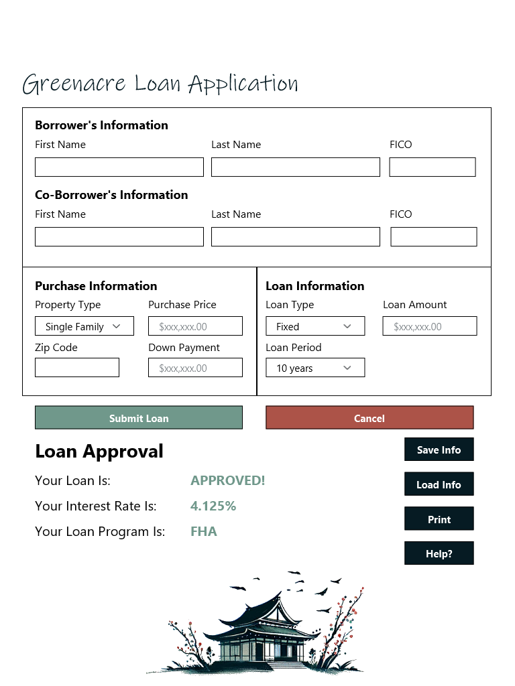

# The Greenacre Loan Application

## Overview

The Greenacre Loan Application facilitates quick pre-approvals for home mortgages and serves as a reference for black box testing studies.

## Background

This application was featured in the **Crafting Excellence: Optimizing Test Case Design with Domain Analysis** talk at the STAREAST 2024 conference.



## Prerequisites

* Node.js (v21.x or higher)
* npm (v10.x or higher)

## Installation

1. Clone the repository: ```git clone [repo-url]```
2. Install dependecies:
    * Client: ```cd client && npm install```
    * Server: ```cd server && npm install```
    * Test: ```cd test && npm install```

## Quick Start

### Client Application

* **Technology**: React
* **Commands**: ```npm start``` - Launches the client application.

### Server Application

* **Technology**: Express
* **Commands**: ```node index.js``` - Starts the server.

### Automated Tests

* **Framework**: Playwright (TypeScript)
* **Running Tests**: ```npx bddgen && npx playwright test```
* **BDD Tests**: Tests are crafted using BDD principles with the playwright-bdd package. See the [Playwright-BDD Documentation](https://vitalets.github.io/playwright-bdd/#) for more details.

> **NOTE**:
> If you are running the tests on a Windows machine, setting the NODE_OPTIONS environment variables and the bddgen process cannot be run in a single command. From _PowerShell_, run ```build-pwsh.ps1``` and then ```playwright test```.

#### More Information

For a detailed guide on Playwright, visit [Playwright official site](https://playwrigh.dev/).

## Application Structure

* **Requirements and UI Mockups**: Detailed documents can be found in the [Requirements](./docs/requirements/requirements.md) and [UI Mockups](./docs/requirements/ui-mockups.md).
* **Data and Utilities**: Includes scripts for test data generation and test validation.

## Future Work

* Dockerization of the the client and server setups.
* Refinement of the current proof of concept, including intentional bug insertion for testing education.
* Exploration into an AI-based testing oracle.

## Licensing

This project is licensed under the MIT license.
